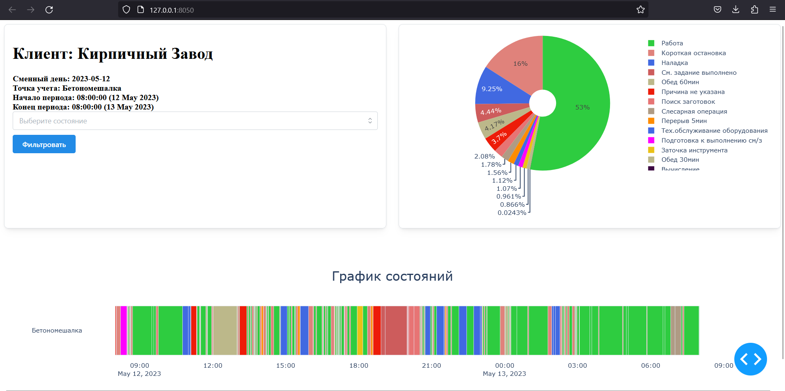

## Описание проекта
Репозиторий `test_task` содержит заготовку web-приложения на фреймворке PlotlyDash, предназначенного для просмотра данных из базы данных SQLite. Задача данного приложения - вывод информации о состояниях точек учета в различных форматах, включая круговую диаграмму причин состояний, диаграмму ганта длительностей причин состояний и дополнительную информацию при наведении.

## Запуск приложения
Для запуска приложения выполните следующие шаги:
1. Убедитесь, что у вас установлен Python (рекомендуется версия 3.6 и выше).

2. Установите необходимые зависимости, указанные в файле `requirements.txt`, выполнив команду: `pip install -r requirements.txt`
3. Перейдите в нужную диреткорию и запустите приложение, выполнив следующую команду:
`cd test_task`
`python app.py`

После выполнения этих шагов, приложение будет доступно по адресу `http://localhost:8050` в вашем веб-браузере.

## Описание полей БД
База данных SQLite (`testDB.db`) содержит следующие поля:

| Название поля                 | Поле              | Комментарий                                           |
| ----------------------------- | ----------------- | ----------------------------------------------------- |
| Наименование клиента          | client_name       |                                                       |
| Id точки учета                | endpoint_id       |                                                       |
| Название точки учета         | endpoint_name     |                                                       |
| Сменный день                 | shift_day         | Отличается от календарного дня смещением на часы    |
| Календарный день             | calendar_day      |                                                       |
| Состояние оборудования       | state             |                                                       |
| Статус состояния – работа/не работа | status        |                                                       |
| Причина состояния            | reason            |                                                       |
| Начало состояния             | state_begin       |                                                       |
| Конец состояния              | state_end         |                                                       |
| Продолжительность состояния в часах | duration_hour |                                                       |
| Продолжительность состояния в минутах | duration_min |                                                       |
| Цвет причины состояния       | color             |                                                       |
| Название периода по расписанию | period_name     |                                                       |
| Название производственной смены | shift_name     |                                                       |
| Имя оператора, работающего за точкой учета | operator |                                                       |
| Время начала регистрации оператора | operator_auth_start |                                                 |
| Время конца регистрации оператора | operator_auth_end |                                                     |
| Начало смены                 | shift_begin       |                                                       |
| Конец смены                  | shift_end         |                                                       |

## Функциональность приложения
Приложение позволяет просматривать данные из базы данных `testDB.db` в различных форматах:

### 1. Вывод общей информации
Общая информация о данных отображается в правой верхней карточке приложения.

### 2. Вывод в виде круговой диаграммы причин состояний
Используется библиотека Plotly Express для построения круговой диаграммы, которая показывает причины состояний.

### 3. Вывод диаграммы ганта длительностей причин состояний
Используется библиотека Plotly Express для построения диаграммы ганта, которая отображает длительности состояний во времени.

### 4. Дополнительная информация при наведении (свойство hovertemplate)
При наведении курсора на элементы диаграммы, отображается дополнительная информация.

### 5. Дополнительная фильтрация по состояниям
Приложение позволяет осуществлять мульти-выбор для фильтрации данных по состояниям.

## Полезные ссылки
- [Plotly Python Graphing Library](https://plotly.com/python/)
- [Документация по фреймворку Dash Plotly](https://dash.plotly.com/)
- [Вспомогательные компоненты Dash Mantine](https://www.dash-mantine-components.com/)
- [Компоненты Bootstrap для Plotly](https://dash-bootstrap-components.opensource.faculty.ai/docs/quickstart/)

## Скриншоты приложения

